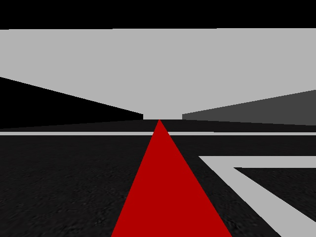
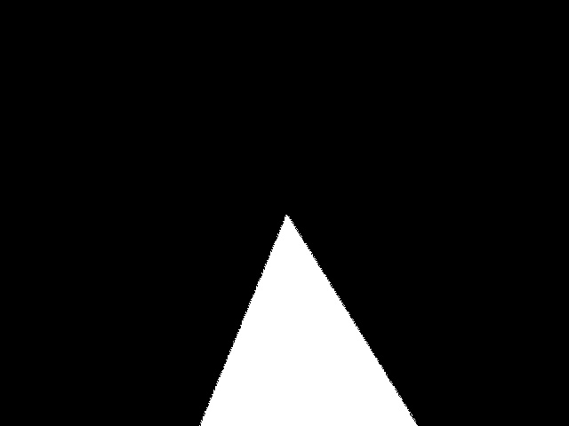
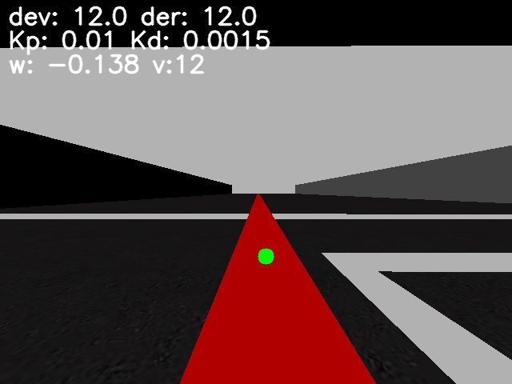

## JdeRobot - Formula 1

En la presente página se recogerá el camino seguido para el desarrollo de la práctica de follow line para la asignatura de Visión Robótica.

### Primeros pasos






### Un controlador real


#### Controlador PD




```
    derivate = deviation - last_deviation
    
    w = - deviation * Kp - derivate * Kd
    
    last_deviation = deviation
```

```
    v = max(1, w * 3)
```


### Dos controladores PD
<video muted controls>
    <source src="video/2.mp4" type="video/mp4">
</video>

### ¿Curva o Recta?

<video muted controls>
    <source src="video/result_both.mp4" type="video/mp4">
</video>
